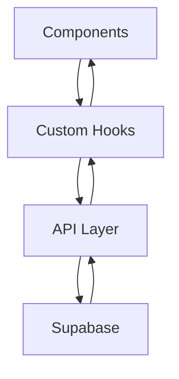

# Architecture Overview

## High-Level Architecture

The Budget Tracker application follows a modern, component-based architecture with clear separation of concerns. The application is built using React and TypeScript, with Supabase providing the backend services.

## Key Architectural Decisions

### 1. Component-Based Architecture

- Small, focused components with single responsibilities
- Clear separation between presentational and container components
- Reusable components for common UI patterns

### 2. Custom Hooks for State Management

- Centralized authentication state with `useAuth`
- Component-specific state management
- Shared business logic in custom hooks

### 3. API Layer Abstraction

- Centralized API calls in the `lib` directory
- Type-safe API interactions
- Error handling patterns

### 4. Type Safety

- Comprehensive TypeScript types
- Shared type definitions
- Runtime type checking where necessary

## Data Flow

## Security Considerations

1. Authentication

   - Supabase authentication
   - Protected routes
   - Secure session management

2. Data Access
   - Row Level Security (RLS)
   - User-specific data isolation
   - Input validation

## Performance Optimizations

1. Component Level

   - Memoization where beneficial
   - Lazy loading of components
   - Efficient re-rendering strategies

2. Data Level
   - Optimistic updates
   - Caching strategies
   - Pagination for large datasets
