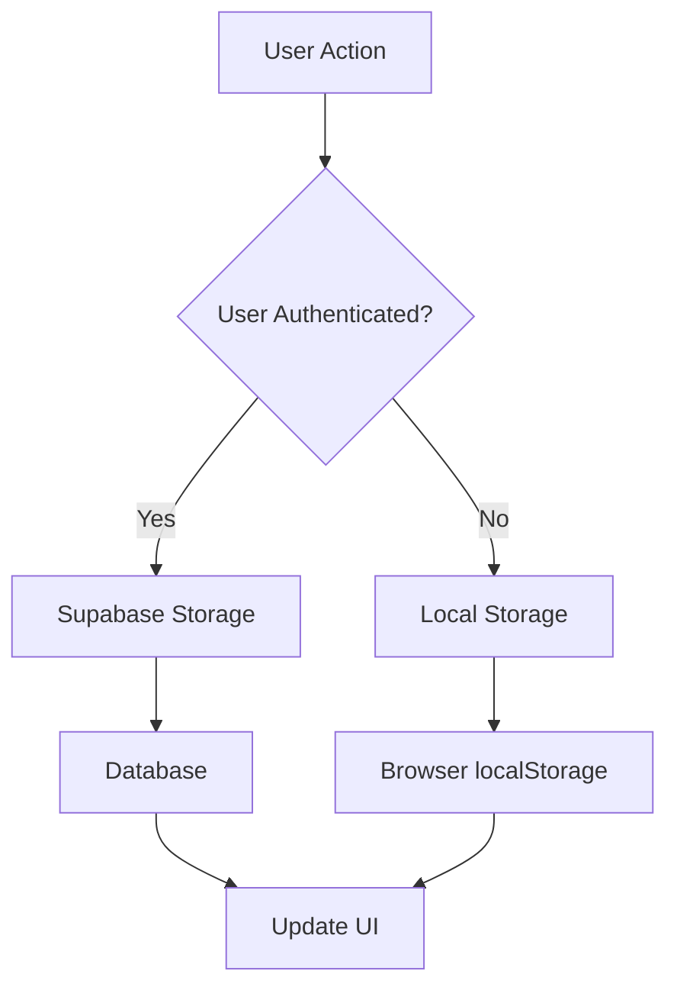
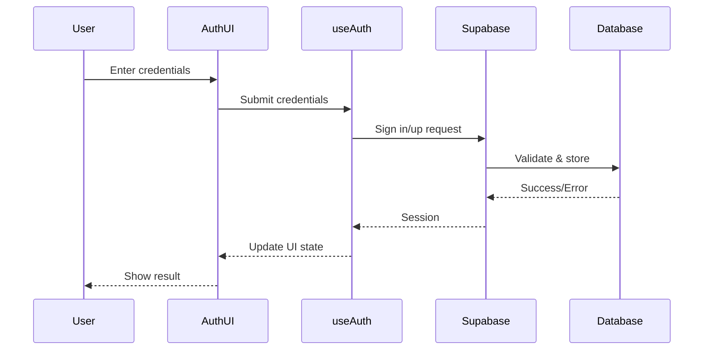
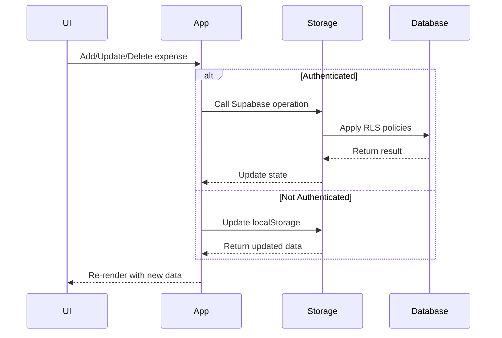
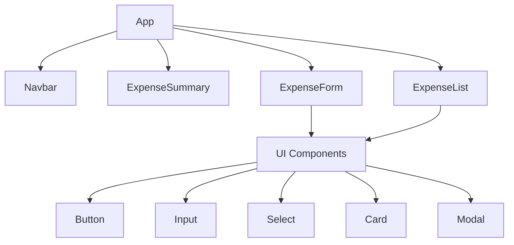
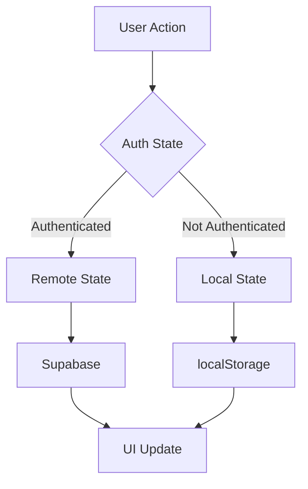
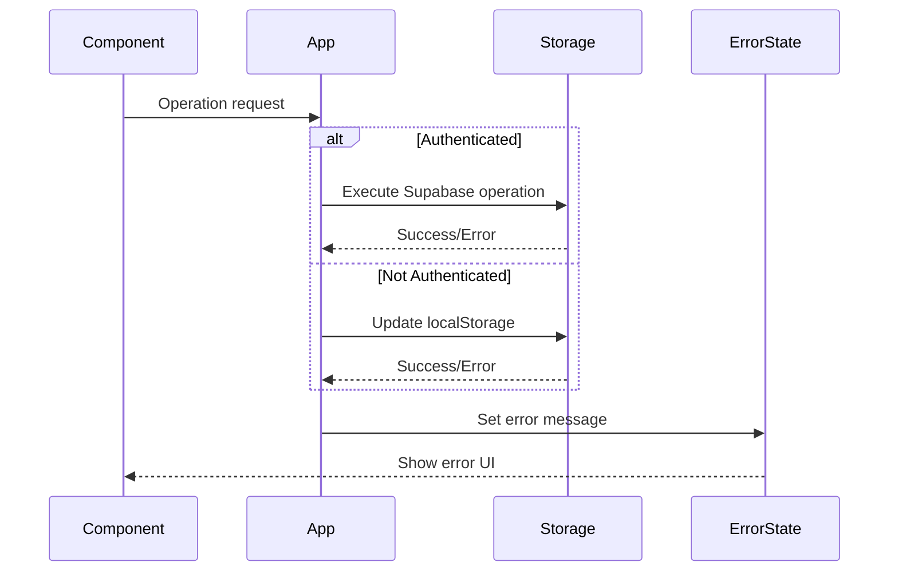

# Data Flow Documentation

## Local vs. Authenticated Storage Flow

## Authentication Flow

## Expense Management Flow

## Component Hierarchy

## State Management Flow

## Error Handling Flow

